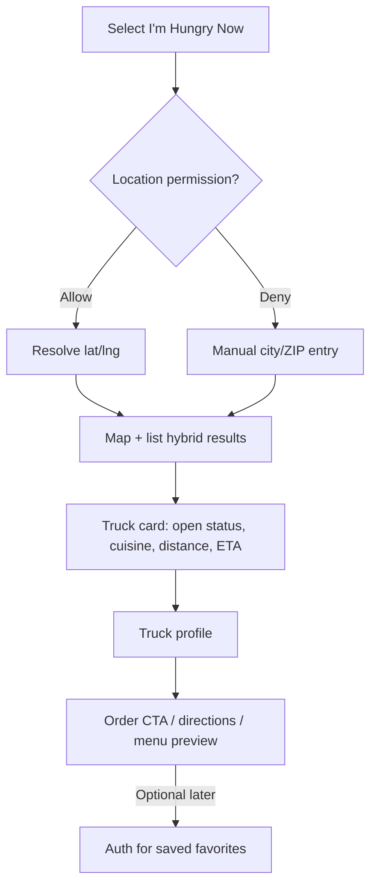
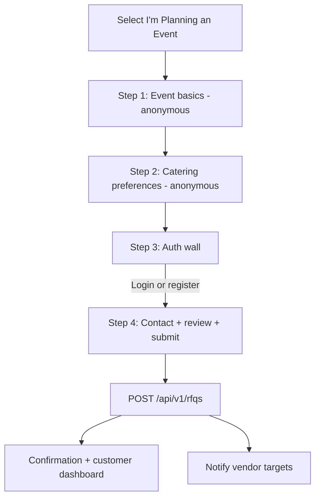
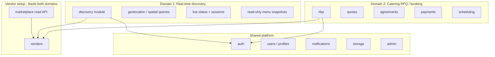
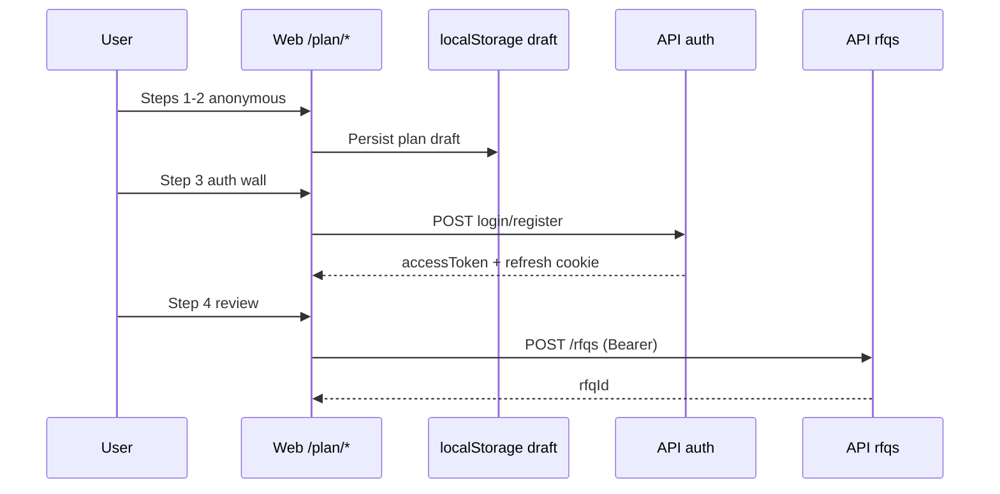
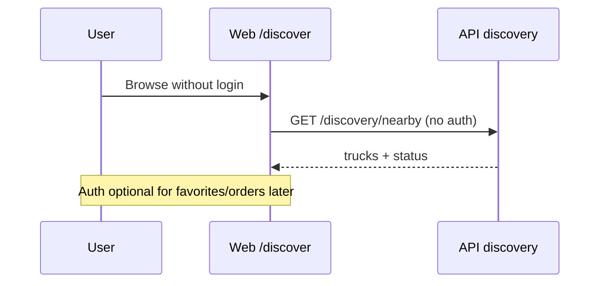
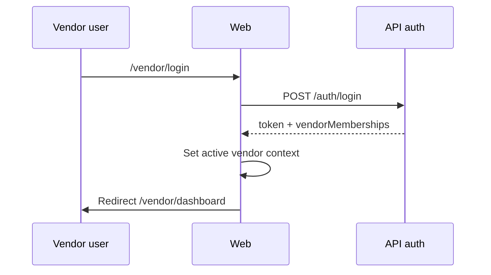
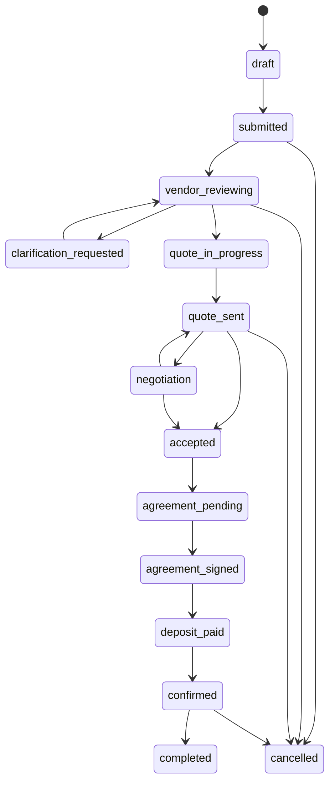
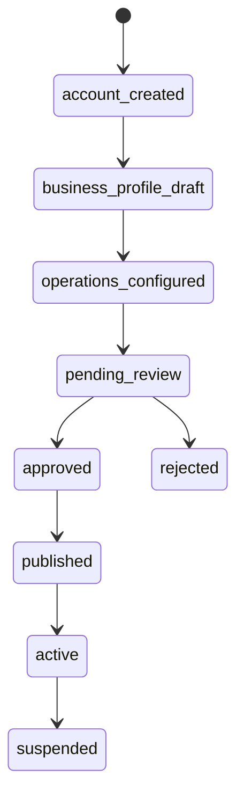

# foodtruckzs Product UX & Architecture Redesign

Document ID: UX-ARCH-002  
Status: Approved for implementation  
Last updated: 2026-05-26

This document defines the dual-intent product model, information architecture, workflows, and production architecture for foodtruckzs. It supersedes flat “single marketplace” assumptions in older page-flow docs while remaining compatible with the existing modular monolith.

---

## 1. Product model: two customer intents + vendor operations

| Intent | User mindset | Primary domain | Auth default | Success metric |
|--------|--------------|----------------|--------------|----------------|
| **I'm Hungry Now** | Immediate, low friction | Real-time discovery | Anonymous until order/contact | Time-to-truck-profile |
| **I'm Planning an Event** | Guided, premium, trustworthy | Catering RFQ / booking | Progressive; required at submit | RFQ submit → quote → booking |
| **Vendor operations** | Business tooling | Vendor + shared platform | Required at login | Onboarded → active → quoting |

Shared platform capabilities: design system, auth, profiles, notifications, files, admin.

---

## 2. UX workflow diagrams

### 2.1 Intent gateway (landing)

```mermaid
flowchart TD
  L[Landing / Intent Gateway] --> H[I'm Hungry Now]
  L --> P[I'm Planning an Event]
  L --> V[Vendor section]
  H --> D[/discover]
  P --> PE[/plan/event]
  V --> VL[/vendor/login]
  V --> VR[/vendor/register]
```

### 2.2 I'm Hungry Now (discovery)



### 2.3 I'm Planning an Event (progressive RFQ)



### 2.4 Vendor authentication & onboarding

```mermaid
flowchart TD
  V[Vendor section on landing] --> L[Vendor login]
  V --> R[Become a vendor]
  L --> DASH[/vendor/dashboard]
  R --> R1[Step 1: Account]
  R1 --> R2[Step 2: Business info]
  R2 --> R3[Step 3: Operations]
  R3 --> R4[Step 4: Admin review]
  R4 -->|Approved| PUB[Marketplace + discovery visibility]
```

---

## 3. Information architecture

```text
foodtruckzs
├── Public / Gateway
│   ├── /                          Intent gateway
│   ├── /discover                  Hungry Now (live discovery)
│   ├── /discover/trucks/[slug]    Live truck profile (discovery mode)
│   ├── /plan/*                    Progressive catering RFQ
│   ├── /marketplace               Catering-oriented search (legacy bridge)
│   └── /vendors/[slug]            Catering vendor profile
├── Customer (authenticated catering)
│   ├── /customer/dashboard
│   ├── /customer/rfqs/[id]
│   ├── /customer/quotes/[id]
│   ├── /customer/agreements/[id]
│   └── /customer/payments/deposits/[id]
├── Vendor (authenticated operations)
│   ├── /vendor/login
│   ├── /vendor/register
│   ├── /vendor/dashboard
│   ├── /vendor/rfqs/*
│   ├── /vendor/onboarding → /vendor/register (redirect)
│   └── /vendor/{menus,availability,calendar,...}
└── Admin
    ├── /admin
    └── /admin/platform-billing
```

**Navigation rule:** Gateway routes use minimal chrome. Domain routes use contextual nav (discovery bottom bar vs catering stepper vs vendor sidebar).

---

## 4. User journey maps

### 4.1 Hungry Now — “office lunch, 12:15pm”

| Stage | User goal | Touchpoints | Emotion | Risks |
|-------|-----------|-------------|---------|-------|
| Arrive | Find food fast | Landing → Discover | Impatient | Too many choices |
| Locate | Confirm trucks nearby | Geolocation / manual | Anxious | Bad GPS |
| Compare | Pick truck | List + map cards | Curious | Stale “open” status |
| Decide | See menu + location | Truck profile | Confident | No ordering yet |
| Act | Directions or order | CTA | Satisfied | Dead link |

### 4.2 Planning an Event — “company picnic, 200 guests”

| Stage | User goal | Touchpoints | Emotion | Risks |
|-------|-----------|-------------|---------|-------|
| Arrive | Start quote process | Landing → Plan | Hopeful | Form fatigue |
| Define event | Date, place, headcount | Plan steps 1–2 | Focused | Missing logistics |
| Commit | Create account | Auth wall | Cautious | Drop-off |
| Submit | Send RFQ | Review + API | Relieved | Incomplete packet |
| Evaluate | Compare quotes | Customer dashboard | Deliberate | Slow vendor response |

### 4.3 Vendor — “new taco truck”

| Stage | User goal | Touchpoints | Emotion | Risks |
|-------|-----------|-------------|---------|-------|
| Discover platform | Learn value | Landing vendor section | Skeptical | Unclear fees |
| Register | Create business | 4-step wizard | Motivated | Long form |
| Configure | Menus, radius, schedule | Ops setup | Overwhelmed | API-only tools today |
| Go live | Admin approval | Admin queue | Waiting | Delay |
| Operate | Respond to RFQs | Vendor inbox | Professional | Missed leads |

---

## 5. Frontend routing structure (Next.js App Router)

### Route groups (target)

```text
apps/web/src/app/
├── layout.tsx                    # ShellRouter (gateway vs app)
├── page.tsx                      # Intent gateway
├── (discovery)/
│   ├── discover/
│   │   ├── page.tsx
│   │   └── trucks/[slug]/page.tsx
│   └── vendors/[slug]/page.tsx   # catering profile (existing)
├── (catering)/
│   ├── plan/
│   │   ├── layout.tsx            # Stepper + draft persistence
│   │   ├── event/page.tsx
│   │   ├── preferences/page.tsx
│   │   ├── account/page.tsx
│   │   └── review/page.tsx
│   ├── rfq/start/                 # Full wizard (power users)
│   └── customer/...
├── (vendor)/
│   ├── vendor/login/page.tsx
│   ├── vendor/register/page.tsx
│   └── vendor/...
└── (admin)/admin/...
```

### Shared route constants

Implemented in `@foodtruckzs/shared` as `ROUTES` for links, redirects, and tests.

### Redirects & compatibility

| Legacy | New canonical |
|--------|----------------|
| `/` search form → marketplace | `/discover` or `/marketplace` by intent |
| `/rfq/start` | `/plan/event` for new users; keep full wizard |
| `/vendor/onboarding` | `/vendor/register` |

---

## 6. Backend domain architecture



### Module boundaries (API)

| Module | Prefix | Owns | Must not own |
|--------|--------|------|--------------|
| `discovery` | `/api/v1/discovery` | Nearby trucks, open status, live location, discovery profiles | Quote/agreement state |
| `marketplace` | `/api/v1/marketplace` | Catering search, published vendor profiles | Real-time GPS sessions |
| `rfqs` | `/api/v1/rfqs` | RFQ lifecycle, messaging, targets | Menu editing |
| `vendors` | `/api/v1/vendors` | Vendor CRUD, menus, availability writes | Customer payment capture |
| `quotes` | `/api/v1/quotes` | Quote revisions, acceptance | Discovery ranking |
| `agreements` | `/api/v1/agreements` | Contracts, signatures | Live truck status |
| `payments` | `/api/v1/payments` | Deposits, Stripe webhooks | Discovery search |
| `scheduling` | `/api/v1/scheduling` | Calendar, catering events | Anonymous browse |

**Rule:** Discovery reads vendor data; it does not mutate RFQ state. Catering modules read vendor eligibility; they do not compute map tiles.

---

## 7. Database entities / models

### Discovery domain (new / extended)

| Entity | Purpose | Key fields |
|--------|---------|------------|
| `vendor_live_sessions` | “Open now” signal | vendor_id, started_at, ends_at, source |
| `vendor_live_locations` | Current map pin | vendor_id, lat, lng, accuracy, updated_at |
| `discovery_menu_snapshots` | Fast menu preview | vendor_id, json payload, version |
| `user_location_searches` | Analytics (optional) | anon_id, lat, lng, radius_m |

Uses existing: `vendors`, `vendor_profiles`, `calendar_events` (type `food_truck_location`), `vendor_menus`.

### Catering domain (existing)

`rfqs`, `rfq_vendor_targets`, `rfq_requirements`, `quotes`, `agreements`, `payments`, `catering_events`, `message_threads`, etc. (see `apps/api/src/db/schema/index.ts`).

### Vendor domain (existing + onboarding)

`vendors.approval_status`, `is_published`, memberships, menus, `availability_rules`, Stripe Connect fields.

---

## 8. Authentication flow diagrams

### 8.1 Customer — progressive catering



### 8.2 Hungry Now — anonymous by default



### 8.3 Vendor login



### Social auth (planned)

- Google / Apple OAuth via `auth_identities` table and callback routes.
- Link to existing `users` row; issue same JWT/session model.

---

## 9. Mobile-first UI recommendations

| Pattern | Hungry Now | Planning Event | Vendor |
|---------|------------|----------------|--------|
| Layout | Full-bleed map + bottom sheet list | Stepper + single column forms | Sidebar collapses to tabs |
| Primary CTA | Sticky “Near me” / filter chips | Sticky “Continue” | Sticky inbox actions |
| Touch targets | ≥ 44px; thumb-zone CTAs | Large selects; date pickers native | Swipe inbox rows (later) |
| Navigation | Bottom tab: Map, List, Profile | Top step indicator | Bottom: Dashboard, RFQs, Calendar |
| Content density | Card stack, photos first | Section panels, trust copy | Tables → cards on mobile |
| Performance | Skeleton list; map lazy load | Save draft locally each step | Paginated RFQ inbox |

Design tokens: dark surfaces, rounded 16–28px cards, accent yellow/orange/purple/cyan/green (see `globals.css`).

---

## 10. State management patterns

| Scope | Pattern | Technology |
|-------|---------|------------|
| Plan draft (anonymous) | Local persisted draft | `localStorage` + `plan-draft.ts` |
| Auth session | Client session store | `useAuthSession()` |
| Discovery search | URL-driven filters + server fetch | RSC + `searchParams` |
| RFQ full wizard | Component state + local draft | `rfq-wizard.tsx` (migrate to reducer) |
| Vendor onboarding | Multi-step form reducer | `vendor-register-wizard.tsx` |
| Server mutations | API client functions | `rfq-api.ts`, `marketplace-api.ts` |
| Future | React Query / TanStack Query | Cache discovery lists, RFQ detail |

**Avoid:** global Redux for MVP. Prefer URL state for shareable discovery searches and step routes for catering.

---

## 11. API / service boundary recommendations

### Discovery service (new)

```
GET  /api/v1/discovery/nearby?lat=&lng=&radiusM=&openNow=
GET  /api/v1/discovery/trucks/:slug
GET  /api/v1/discovery/trucks/:slug/menu-preview
POST /api/v1/discovery/trucks/:id/check-in   (vendor only)
```

### Marketplace service (existing — catering-oriented)

```
GET /api/v1/marketplace/vendors?serviceArea=&cuisine=&guestCount=...
GET /api/v1/marketplace/vendors/:slug
```

### RFQ service (existing)

```
POST /api/v1/rfqs
GET  /api/v1/customers/me/rfqs
...
```

**Anti-patterns**

- Do not add RFQ filters to discovery endpoints.
- Do not use marketplace search for “open now” — different indexes and freshness requirements.

---

## 12. Role / permission model

### Global roles (`users.global_roles`)

| Role | Discovery | Catering customer | Vendor ops | Admin |
|------|-----------|-------------------|------------|-------|
| `customer` | Browse | RFQ, quotes, pay | — | — |
| `platform_admin` | All | All | All | All |
| `support_admin` | Read | Assist | Read | Limited write |

### Vendor membership roles (`vendor_memberships.role`)

| Role | RFQ inbox | Quotes | Menus | Billing | Live check-in |
|------|-----------|--------|-------|---------|---------------|
| `owner` | ✓ | ✓ | ✓ | ✓ | ✓ |
| `manager` | ✓ | ✓ | ✓ | — | ✓ |
| `staff` | ✓ | draft | — | — | ✓ |
| `viewer` | read | read | read | read | read |

Enforcement: `require-role`, `require-vendor` middleware on API; Next.js middleware (planned) for `/customer/*`, `/vendor/*`, `/admin/*`.

---

## 13. RFQ lifecycle state machine

States (from `rfq-state-machine.ts`):



**Vendor target** (per `rfq_vendor_targets`) has its own status: `invited` → `viewed` → `accepted` | `declined`.

---

## 14. Vendor onboarding lifecycle



| Step | UI route | API | Gate |
|------|----------|-----|------|
| 1 Account | `/vendor/register` | `POST /auth/register`, `POST /vendors` | Email verified (future) |
| 2 Business | register step 2 | `PATCH /vendors/:id/profile` | Required fields |
| 3 Operations | register step 3 | menus, availability, pricing | Min data for matching |
| 4 Approval | status screen | Admin `approve` | `approval_status=approved`, `is_published=true` |

---

## 15. Wireframe-level screen breakdowns

### Landing `/`

- Hero: brand + tagline
- **Card A:** I'm Hungry Now (orange) → `/discover`
- **Card B:** I'm Planning an Event (purple) → `/plan/event`
- **Vendor strip:** Login | Become a vendor
- Footer: marketplace link for catering search power users

### Discover `/discover`

- Location bar (GPS + manual)
- Map placeholder (60vh mobile)
- Horizontal filter chips: Open now, Cuisine, Distance
- Vertical list cards: avatar, name, OPEN badge, distance, wait, cuisine
- Tap → `/discover/trucks/[slug]` or `/vendors/[slug]?mode=live`

### Plan steps `/plan/*`

1. **Event:** type, date, location, guest count
2. **Preferences:** cuisines, budget, trucks count, duration, notes
3. **Account:** auth panel + value prop copy
4. **Review:** summary + submit → API or handoff to full `/rfq/start`

### Vendor register `/vendor/register`

- Stepper 1–4 with save & continue
- Step 4: “Pending review” state with checklist

---

## 16. Production scalability considerations

| Area | MVP | Scale path |
|------|-----|------------|
| Discovery geo queries | PostGIS or lat/lng bbox + index | Redis geo cache, read replica |
| Live status | DB `vendor_live_sessions` | WebSocket / SSE fanout |
| RFQ writes | Single Postgres primary | Partition by `created_at` year |
| Search | SQL filters | OpenSearch for marketplace text |
| Media | Local/S3 adapter | CDN in front of object storage |
| Jobs | `outbox_events` table | Redis queue workers |
| Multi-region | Single VPS | Read replicas + stateless API scale-out |
| Rate limits | Fastify rate limiter | Per-IP + per-user Redis limits |

**Observability:** structured logs per domain module, trace IDs on RFQ submit and payment webhooks.

**Security:** vendor scope on every mutation; public discovery never exposes draft menus or private RFQ data.

---

## 17. Implementation phases

| Phase | Scope | Status |
|-------|--------|--------|
| P0 | Intent gateway, route scaffolds, this document | In progress |
| P1 | Plan progressive flow + auth wall before submit | Done (unified `/plan/*` wizard) |
| P2 | Discovery API + live session schema | Scaffolded |
| P3 | Full discover map integration (Mapbox/Google) | Planned |
| P4 | OAuth Google/Apple | Planned |
| P5 | Next.js middleware auth guards | Planned |
| P6 | Split Drizzle schema by domain | Planned |

---

## References

- `docs/architecture-design-document.md` — modular monolith baseline
- `apps/api/src/modules/rfqs/rfq-state-machine.ts` — RFQ transitions
- `apps/web/src/app/` — current routes
- `packages/shared/src/routes.ts` — canonical path constants
